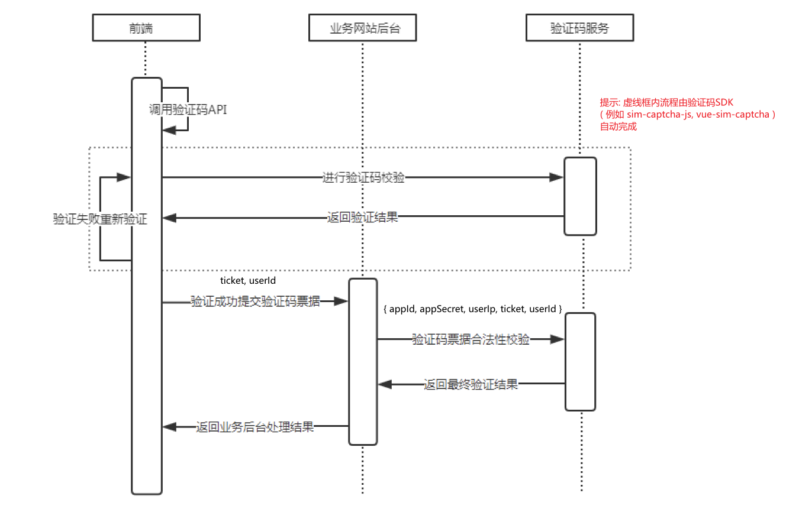

<p align="center">

</p>
<h1 align="center">SimCaptcha</h1>

> :cake: 一个简单易用的点触验证码, 包含了前端与后端实现

[]()
[](https://github.com/yiyungent/SimCaptcha/blob/master/LICENSE)
[](https://www.nuget.org/packages/SimCaptcha/)
[](https://www.nuget.org/packages/SimCaptcha/)

<!-- [English](README_en.md) -->

## 介绍

一个简单易用的点触验证码促进你的开发

- **简单** - 约定优于配置, 以最少的配置帮助你专注于业务.
- **易扩展** - 松散架构, 轻松扩展.
- **开箱即用** - 使用现有 Web SDK 接入后端验证

## 在线演示

- http://captcha-client.moeci.com/index.html
  - 仅供演示, 不稳定, 且非最新版
  - 用户名，密码 均为 admin

## 前后端调用时序图



## 依赖

只需要满足下方其中一条.

- .NET Framework (>= 4.0) 被安装.
- .NET Standard (>= 2.0) 被安装.

## 安装

推荐使用 [NuGet](https://www.nuget.org/packages/SimCaptcha), 在你项目的根目录 执行下方的命令, 如果你使用 Visual Studio, 这时依次点击 **Tools** -> **NuGet Package Manager** -> **Package Manager Console** , 确保 "Default project" 是你想要安装的项目, 输入下方的命令进行安装.

```bash
PM> Install-Package SimCaptcha
```

#### 在 ASP.NET Core 下使用

```bash
PM> Install-Package SimCaptcha.AspNetCore
```

## 快速开始

#### 在 ASP.NET Core 下 三步搭建验证服务端

```csharp
// Startup.cs 
// 注意: 省略了部分代码, 只保留主要部分, 详见示例(/examples/EasyAspNetCoreService)
// 仅适用于 SimCaptcha.AspNetCore v0.3.0+
public void ConfigureServices(IServiceCollection services)
{
    // 1.重要: 注册验证码配置
    services.Configure<SimCaptchaOptions>(Configuration.GetSection(SimCaptchaOptions.SimCaptcha));

    // 2.添加 SimCaptcha
    services.AddSimCaptcha();
}

public void Configure(IApplicationBuilder app, IWebHostEnvironment env)
{
    // 3.启用 SimCaptcha 中间件
    app.UseSimCaptcha();

    // 现在
    // "https://yourdomain.com/api/SimCaptcha/Img", "https://yourdomain.com/api/SimCaptcha/Check", "https://yourdomain.com/api/SimCaptcha/TicketVerify"
    // 将开始工作
}
```

## Docker 快速部署

下方为部署验证码服务端：

```bash
docker run -d -p 5004:80 -e ASPNETCORE_URLS="http://*:80" --name simcaptcha-container yiyungent/simcaptcha
```

> 注意：若使用 Docker 同时部署验证码服务端，业务（客户）端，  
> 需注意Docker容器隔离，默认容器之间无法网络通信，  
> 需使其在一个网络下，用于客户端访问服务端验证票据，可参考仓库根目录 `docker-compose.yml`，  
> 同时，若客户端与服务端非同源域名，  
> 需注意跨域问题，Docker下验证码服务端配置文件：`/app/appsettings.Docker.json`  
> 事实上，若使用 Docker快速部署验证服务端，  
> 则一定要修改 `/app/appsettings.Docker.json` 其中的 `SimCaptcha.AppList.CorsWhiteList`，添加上你的客户端域名。

## 使用

- [详细文档(/docs)](https://moeci.com/SimCaptcha "在线文档") 文档构建中
- [见示例(/examples)](https://github.com/yiyungent/SimCaptcha/tree/master/examples)

## 环境

- 运行环境: .NET Framework (>= 4.0) or .NET Standard (>= 2.0)
- 开发环境: Visual Studio Community 2019

## 相关项目

- [sim-captcha-js](https://github.com/yiyungent/sim-captcha-js)
- [vue-sim-captcha](https://github.com/yiyungent/vue-sim-captcha)

## 鸣谢

- 点触验证码设计参考自 <a href="https://github.com/wangchengqun/NetCoreVerificationCode" target="_blank">NetCoreVerificationCode</a>，感谢作者 wangchengqun 的贡献
- 验证码默认字体来自：[站酷字库](https://www.zcool.com.cn/special/zcoolfonts/)，感谢授权

## Donate

SimCaptcha is an MIT licensed open source project and completely free to use. However, the amount of effort needed to maintain and develop new features for the project is not sustainable without proper financial backing.

We accept donations through these channels:

- <a href="https://afdian.net/@yiyun" target="_blank">爱发电</a>

## Author

**SimCaptcha** © [yiyun](https://github.com/yiyungent), Released under the [MIT](./LICENSE) License.<br>
Authored and maintained by yiyun with help from contributors ([list](https://github.com/yiyungent/SimCaptcha/contributors)).

> GitHub [@yiyungent](https://github.com/yiyungent)
