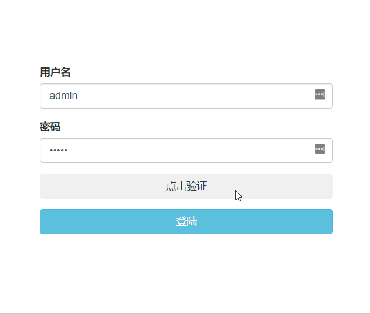
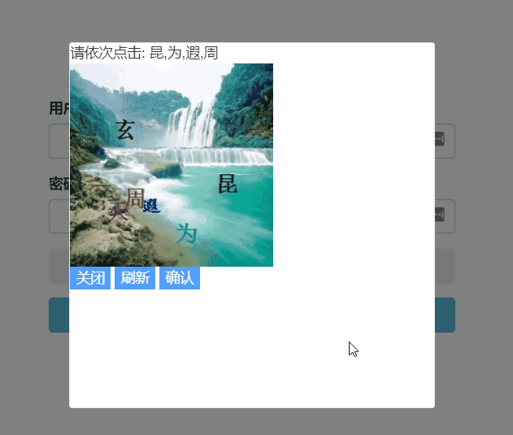

<p align="center">

</p>
<h1 align="center">SimCaptcha</h1>

> :cake: 一个简单易用的点触验证码

[]()
[](https://github.com/yiyungent/SimCaptcha/blob/master/LICENSE)
[](https://app.fossa.com/projects/git%2Bgithub.com%2Fyiyungent%2FSimCaptcha?ref=badge_shield)
[](https://www.nuget.org/packages/SimCaptcha/)
[](https://www.nuget.org/packages/SimCaptcha/)


[English](README_en.md)

## 介绍

一个简单易用的点触验证码促进你的开发
 + **优雅** - 简单易用.
 + **丰富** - 支持多个平台, 包括 ASP.NET MVC, ASP.NET Core等.
 + **免费** - MIT协议 发布

## 截图




## 持续集成

| 环境 | 平台 | 状态 |
| :------: | :------: | :------: |
| Ubuntu-16.04 | .net core 2.0.0 | [](https://dev.azure.com/SimCaptcha/SimCaptcha/_build/latest?definitionId=1&branchName=master) |
| Linux | mono 5.18.0.240 | [](https://travis-ci.com/yiyungent/SimCaptcha) |

## 依赖

只需要满足下方其中一条.

- .NET Framework (>= 4.0) 且 Newtonsoft.Json (>= 4.5.11) 被安装.
- .NET Standard (>= 2.0) 且 Microsoft.CSharp (>= 4.5.0), Newtonsoft.Json (>= 9.0.1) 被安装.

## 安装

推荐使用 [NuGet](https://www.nuget.org/packages/SimCaptcha), 在你项目的根目录 执行下方的命令, 如果你使用 Visual Studio, 这时依次点击 **Tools** -> **NuGet Package Manager** -> **Package Manager Console** , 确保 "Default project" 是你想要安装的项目, 输入下方的命令进行安装.

```bash
PM> Install-Package SimCaptcha
```

## 快速开始

```csharp
using SimCaptcha.Core;
   ...
// 初始化 网易云音乐API
Meting api = new Meting(ServerProvider.Netease);
// 获得 json 数据
string jsonStr = api.FormatMethod(true).Search("Soldier", new SimCaptcha.Core.Models.Standard.Options
{
    page = 1,
    limit = 50
});

return Content(jsonStr, "application/json");
//[{"id":"35847388","name":"Hello","artist":["Adele"],"album":"Hello","pic_id":"1407374890649284","url_id":"35847388","lyric_id":"35847388","source":"netease"},{"id":"33211676","name":"Hello","artist":["OMFG"],"album":"Hello",...
```

## 使用

- [详细文档(/docs)](https://yiyungent.github.io/SimCaptcha "在线文档")

## 环境

- 运行环境: .NET Framework (>= 4.0) or .NET Standard (>= 2.0)    
- 开发环境: Visual Studio Community 2017

## 相关项目

- 
 
## 鸣谢

- 点触验证码设计参考自 <a href="https://github.com/wangchengqun/NetCoreVerificationCode" target="_blank">NetCoreVerificationCode</a>，感谢作者 wangchengqun 的贡献

## 开放源代码许可

[](https://app.fossa.com/projects/git%2Bgithub.com%2Fyiyungent%2FSimCaptcha?ref=badge_large)

## Contributors

Thanks goes to these wonderful people ([emoji key](https://allcontributors.org/docs/en/emoji-key)):

<!-- ALL-CONTRIBUTORS-LIST:START - Do not remove or modify this section -->
<!-- prettier-ignore -->
<table><tr><td align="center"><a href="https://yiyungent.github.io"><br /><sub><b>yiyun</b></sub></a><br /><a href="https://github.com/yiyungent/SimCaptcha/commits?author=yiyungent" title="Code">💻</a> <a href="https://github.com/yiyungent/SimCaptcha/commits?author=yiyungent" title="Documentation">📖</a> <a href="#example-yiyungent" title="Examples">💡</a> <a href="#maintenance-yiyungent" title="Maintenance">🚧</a> <a href="https://github.com/yiyungent/SimCaptcha/commits?author=yiyungent" title="Tests">⚠️</a></td></tr></table>

<!-- ALL-CONTRIBUTORS-LIST:END -->

This project follows the [all-contributors](https://github.com/all-contributors/all-contributors) specification. Contributions of any kind welcome!

## Donate

SimCaptcha is an MIT licensed open source project and completely free to use. However, the amount of effort needed to maintain and develop new features for the project is not sustainable without proper financial backing.

We accept donations through these channels:
- <a href="https://afdian.net/@yiyun" target="_blank">爱发电</a>

## Author

**SimCaptcha** © [yiyun](https://github.com/yiyungent), Released under the [MIT](./LICENSE) License.<br>
Authored and maintained by yiyun with help from contributors ([list](https://github.com/yiyungent/SimCaptcha/contributors)).

> GitHub [@yiyungent](https://github.com/yiyungent)

